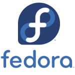
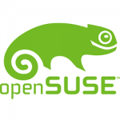
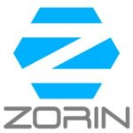

# Materi
1. [Pengenalan](#pengenalan)
2. [Konsep](#konsep)
3. [CLI](#command-line-interface)
4. [Tugas Mandiri](#tugas-mandiri)

# Pengenalan
Sub-materi
1. [Pengertian Linux](#1-pengertian-linux)
2. [Sejarah Linux](#2-sejarah-linux)
3. [Distro Linux](#3-distro-linux)
4. [Perbedaan Linux, MAC, dan Windows](#4-perbedaan-linux-mac-dan-windows)

### 1. Pengertian Linux
**Linux** adalah nama yang diberikan kepada sistem operasi bertipe **Unix**. Linux merupakan salah satu contoh hasil pengembangan perangkat lunak *open source*. Seperti perangkat *open source* lain pada umumnya, kode sumber Linux dapat dimodifikasi, digunakan dan didistribusikan kembali secara bebas oleh siapa saja.

### 2. Sejarah Linux
**Linux** dikembangkan pertama kali oleh **Linux Torvalds** pada tahub 1991, Linux dirilis di bawah Lisensi Publik Umum GNU versi 2. Linux aslinya dikembangkan untuk komputer pribadi berarsitektur Intel x86, tetapi seiring waktu Linux telah diportasi ke berbagai arsitektur, lebih banyak daripada sistem operasi lainnya.
Linux juga mendominasi di pasar pensel melalui sistem operasi Android buatan Google, yang digunakan sekitar 72.7 persen secara global per 2021.
   Linux dulunya adalah proyek hobi yang dikerjakan oleh Linus Torvalds yang memperoleh inspirasi dari Minix. Minix adalah sistem UNIX kecil yang dikembangkan oleh Andrew S. Tanenbaum, seorang professor yang menggeluti penelitian masalah OS dari Vrije Universiteit, Belanda.Linux versi 0.01 dikerjakan sekitar bulan Agustus 1991. Kemudian pada bulan Oktober 1991 tanggal 5, Linus mengumumkan versi resmi Linux, yaitu 0.02 yang hanya dapat menjalankan bash (GNU Bourne Again Shell) dan gcc (GNU C Compiler). Sekarang Linux adalah sistem UNIX yang lengkap, bisa digunakan untuk jaringan (networking), pengembangan software, dan bahkan untuk keperluan sehari-hari.

### 3. Distro Linux
**Distro Linux** (singkatan dari **distribusi Linux**) adalah sebutan untuk sistem operasi komputer dan aplikasinya, merupakan keluarga yang menggunakan kernel Linux.

**1. Ubuntu**

Ubuntu merupakan suatu sistem operasi yang berbasikan pada Debian yang dikembangkan pada tahun 2004 oleh suatu perusahaan dari Afrika Selatan yang bernama _Canonical ltd_.  Asal penamaan dari Ubuntu ini juga berasal dari bahasa Afrika Selatan yang berarti kemanusiaan. Dengan sifatnya sebagai OS open source, Ubuntu sengaja diprioritaskan untuk kepentingan umum atau server.
Ubuntu sendiri memiliki kelebihan dan kekurangan antara lain :  
      | Kelebihan  |  Kekurangan |
      |------------|-------------|
      | Menyediakan OS gratis| Tampilan menuntut adaptasi|
      | Ramah Pemula| Aplikasi relatif sedikit apabila dibandingkan dengan sistem operasi lain|
      | Mendukung berbagai Aplikasi|  Kurang cocok untuk gaming|
      | Mendukung Banyak Perangkat dengan Baik|                |
      | Memiliki Banyak Jenis Sesuai Kebutuhan|                |

**2. Debian**

Debian pertama kali diperkenalkan pada tahun 1993 oleh Ian Murdock. Nama Debian berasal dari kombinasi nama Ian dengan mantan-kekasihnya Debra Lynn: Deb dan Ian. Salah satu alasan mengapa Debian ini termasuk Distro Linux yang paling banyak digunakan adalah karena security-nya yang bagus.Debian dapat digunakan oleh beragam kebutuhan seperti desktop dan juga server yang memfokuskan kestabilan serta keamanan. Debian juga memiliki kelebihan dan kekurangan antaralain : 
      | Kelebihan  |  Kekurangan |
      |------------|-------------|
      | Lebih aman dibandingkan sistem operasi lain, jarang sekali ditemui virus| Harus membiasakan dengan software-software yang kompatibel dengan linux|
      | Perangkat lunak gratis| Memakan repository sebesar 40-60 GB|
      | Selalu update pembaruan sistem|  Saat terjadi masalah error pada linux sulit mengatasinya|
      | Mendukung berbagai jenis komputer yang ada pada saat ini, dan tidak ribet dalam instalasi driver|                |
      | Sistem tidak akan mudah berhenti atau mengalami hang saat menjalankan program secara rutin dalam kurun waktu yang lama sekalipun|                |

**3. Mint**

 

Jika sebelumnya kita mengetahui bahwa Distro Linux yang bernama Ubuntu dibuat dengan berbasiskan pada Debian, maka kali ini ada Distro yang berbasiskan pada Debian dan Ubuntu. Namanya adalah Mint atau yang biasa disebut Linux Mint. 
Linux Mint sendiri sangat user-friendly karena tampilannya yang nyaman digunakan. Sangat mudah digunakan bahkan untuk pemula.

**4. Red Hat**

Red Hat pertama kali dikenalkan pada tahun 1993 oleh salah satu perusahaan bernama Red Hat Inc dan seringkali juga disebut Red Hat Linux. Kemudian pada tahub 2003 diganti menjadi Red Hat Enterprise Linux khusus untuk lingkungan perusahaan. Sistem operasi ini juga yang pertama kali mempopulerkan penggunaan sistem _RPM Package Manager_.

**5. Fedora**

Fedora Merupakan salah satu Distro Linux yang dikembangkan oleh tim **Fedora Project** dan disponsori oleh Red Hat. Bahkan nama Fedora ini diambil dari salah satu Karakter dalam logo Red Hat itu sendiri. Sama halnya dengan Red Hat, sistem operasi Fedora juga menggunakan sistem _RPM Package Manager_.

**6. CentOS**

 

CentOS merupakan singkatan dari _Community Enterprise Operating System_ dan merupakan salah satu contoh Distro Linux yang dikembangkan oleh The CentOS Project. Sistem operasi ini dibuat menggunakan  kode sumber yang berasala dari Red Hat. Oleh karena itu, dalam hal produk CentOs sangatlah mirip dengan Red Hat Enterprise Linux.

**7. Mandrake (Mandriva)**

Sistem operasi Mandrake atau yang juga bisa disebut Mandriva Linux merupakan satu jenis Distro Linux yang dikembangkan oleh suatu perusahaan bernama Mandriva. Sama halnya dengan Fedora, sistem operasi Mandrake ini juga menggunakan sistem _RPM Package Manager_.

**8. openSUSE**

openSUSE ini juga termasuk salah satu sistem operasi yang didibuat diatas kernel Linux. openSUSE Project selaku pihak pengembang menciptakan OS ini dengan tujuan agar penggunan Linux dapat lebih maju dengan kinerjanya yang stabil dan ramah pengguna. openSUSE ini lebih sering digunakan sebagai sistem operasi desktop atau server.

**9. Arch Linux**

Arch Linux (dikenal juga dengan ArchLinux atau Arch) adalah salah satu Distro Linux yang didesain lebih ringan dan sederhana. Arch Linux berbasis biner, yang artinya, paket-paket aplikasi distibusikan dalam bentuk bentuk telah terkompilasi. Berbeda dengan OS Linux lainnya yang mendistribusikan paket-paketnya dalam bentuk kode sumber.

**10. Zorin**

Zorin ini merupakan salah satu Distro Linux yang memiliki tampilan grafis sangat mirip dengan Windows dan Mac OS, bahkan termasuk pada aplikasi – aplikasinya. Sejak awal tujuan pembuatan sistem operasi ini memang agar para pengguna yang terbiasa dengan Windows dan Mac OS dapat menikmati fitur dari Linux tanpa harus mengalami kesulitan.

### 4. Perbedaan Linux, MAC, dan Windows

| ASPEK     | LINUX | MAC | WINDOWS |
|-----------|-------|-----|---------|
| Keamanan  | Memiliki tingkat keamanan paling kuat | Sulit terkena virus | Rentan terkena virus |
| Ekonomis / Harga | Gratis | Berbayar | Berbayar
| Tampilan  | Tampilan pada Linux sangat mudah dimengerti oleh penggunanya, tetapi tidak unggul dalam grafis | Dari segi tampilan, Macintosh paling bagus dari Windows dan Linux, desain dan stylenya tampak sangat premium dan indah dimata konsumen | Windows unggul dalam segi grafis, memiliki tampilan yang bagus dan mudah dimengerti oleh penggunanya |
| Performance | Performa Linux sangat bagus dari segi UI dan tidak terlalu memakan banyak resources | High performance, dengan prosesor Intel terbaru dan inovasi terbaik lainnya  | Performa lumayan baik tetapi dengan rentannya terhadap virus membuat performanya tidak maksimal sehingga cenderung lambat karena terlalu banyak detail pada UI yang menyebabkan meningkatnya ukuran Windows secara tidak langsung yang menghambat proses komputer |
| User | Banyak user yang belum terbiasa menggunakan Linux dan lumayan sulit untuk dipelajari bagi pemula | User-friendly, dengan tampilan GUI yang sangat menarik, membuat Mac OS menjadi salah satu OS yang banyak diminati khususnya oleh para graphic designer | Paling disukai karena lebih mudah dipakai dan hampir digunakan oleh mayoritas pengguna komputer di dunia |
| User Interface | Memiliki banyak user interface | Tidak memilik banyak user interface, tetapi lebih mudah dipakai dan tampilannya menarik | Tidak memilik banyak user interface |
| Kelengkapan Program | Sudah terdapat banyak program yang siap dipakai | Sudah terdapat program yang siap dipakai, tetapi tidak terlalu banyak | Pertama kali memakai harus menginstall program aplikasi yang lain |
| Pilihan Sistem Operasi | Linux banyak jenis yang bisa kita pilih baik lokal maupun luar | Macintosh tidak terlalu banyak yang disediakan | Windows tidak banyak varian/jenis yang ditawarkan |
| Segi Hardware | Ada beberapa hardware yang tidak bekerja atau belum maksimal karena vendor yang tidak menyediakan driver versi Linux | Mac tidak bisa dirakit sendiri karena Apple sudah tidak memberi license buat perusahaan lain untuk membuat hardware yang bisa menggunakan Mac OS | Di Windows, jarang terjadi masalah yang berkaitan dengan hardware, karena banyak vendor yang mensupport Windows |
