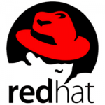
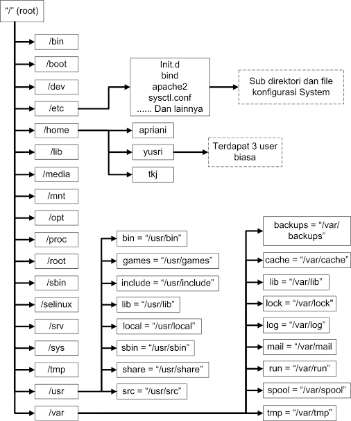
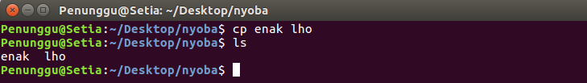
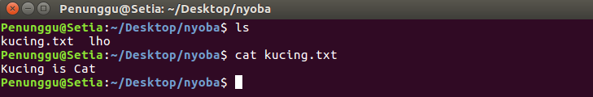
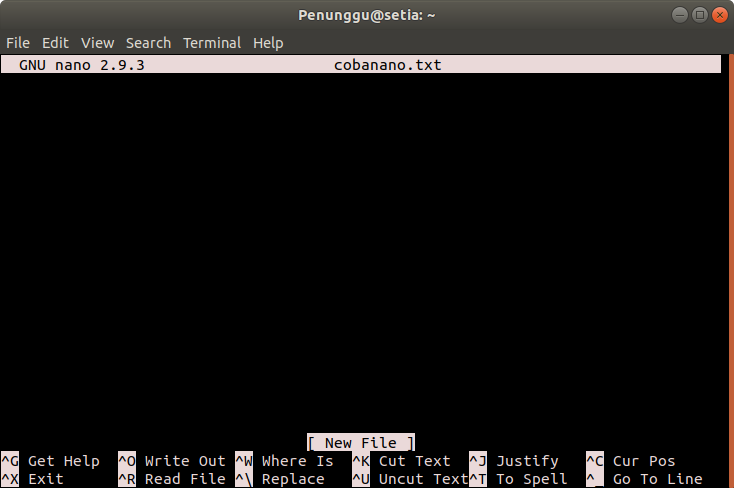
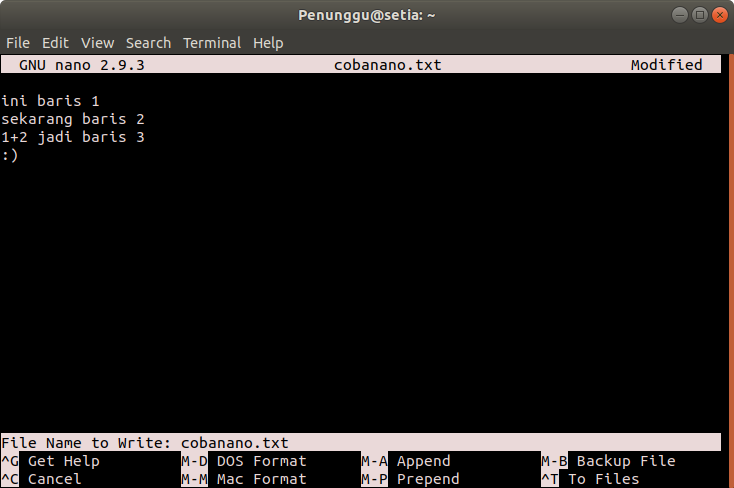

# Materi
1. [Pengenalan](#pengenalan)
2. [Konsep](#konsep)
3. [CLI](#command-line-interface)


# Pengenalan
Sub-materi
1. [Pengertian Linux](#1-pengertian-linux)
2. [Sejarah Linux](#2-sejarah-linux)
3. [Distro Linux](#3-distro-linux)
4. [Perbedaan Linux, MAC, dan Windows](#4-perbedaan-linux-mac-dan-windows)

### 1. Pengertian Linux
**Linux** adalah nama yang diberikan kepada sistem operasi bertipe **Unix**. Linux merupakan salah satu contoh hasil pengembangan perangkat lunak *open source*. Seperti perangkat *open source* lain pada umumnya, kode sumber Linux dapat dimodifikasi, digunakan dan didistribusikan kembali secara bebas oleh siapa saja.

### 2. Sejarah Linux
**Linux** dikembangkan pertama kali oleh **Linux Torvalds** pada tahub 1991, Linux dirilis di bawah Lisensi Publik Umum GNU versi 2. Linux aslinya dikembangkan untuk komputer pribadi berarsitektur Intel x86, tetapi seiring waktu Linux telah diportasi ke berbagai arsitektur, lebih banyak daripada sistem operasi lainnya.
Linux juga mendominasi di pasar pensel melalui sistem operasi Android buatan Google, yang digunakan sekitar 72.7 persen secara global per 2021.
   Linux dulunya adalah proyek hobi yang dikerjakan oleh Linus Torvalds yang memperoleh inspirasi dari Minix. Minix adalah sistem UNIX kecil yang dikembangkan oleh Andrew S. Tanenbaum, seorang professor yang menggeluti penelitian masalah OS dari Vrije Universiteit, Belanda.Linux versi 0.01 dikerjakan sekitar bulan Agustus 1991. Kemudian pada bulan Oktober 1991 tanggal 5, Linus mengumumkan versi resmi Linux, yaitu 0.02 yang hanya dapat menjalankan bash (GNU Bourne Again Shell) dan gcc (GNU C Compiler). Sekarang Linux adalah sistem UNIX yang lengkap, bisa digunakan untuk jaringan (networking), pengembangan software, dan bahkan untuk keperluan sehari-hari.

### 3. Distro Linux
**Distro Linux** (singkatan dari **distribusi Linux**) adalah sebutan untuk sistem operasi komputer dan aplikasinya, merupakan keluarga yang menggunakan kernel Linux.

**1. Ubuntu**


Ubuntu merupakan suatu sistem operasi yang berbasikan pada Debian yang dikembangkan pada tahun 2004 oleh suatu perusahaan dari Afrika Selatan yang bernama _Canonical ltd_.  Asal penamaan dari Ubuntu ini juga berasal dari bahasa Afrika Selatan yang berarti kemanusiaan. Dengan sifatnya sebagai OS open source, Ubuntu sengaja diprioritaskan untuk kepentingan umum atau server.
Ubuntu sendiri memiliki kelebihan dan kekurangan antara lain : 
| KELEBIHAN | KEKURANGAN |
|:----------|:-----------|
| Menyediakan OS gratis  | Tampilan menuntut adaptasi |
| Ramah Pemulas | Aplikasi relatif sedikit apabila dibandingkan dengan sistem operasi lain | 
| Mendukung berbagai Aplikasi  | Kurang cocok untuk gaming |
| Mendukung Banyak Perangkat dengan Baik |  | 
| Memiliki Banyak Jenis Sesuai Kebutuhan  |  |
<br>

**2. Debian**


Debian pertama kali diperkenalkan pada tahun 1993 oleh Ian Murdock. Nama Debian berasal dari kombinasi nama Ian dengan mantan-kekasihnya Debra Lynn: Deb dan Ian. Salah satu alasan mengapa Debian ini termasuk Distro Linux yang paling banyak digunakan adalah karena security-nya yang bagus.Debian dapat digunakan oleh beragam kebutuhan seperti desktop dan juga server yang memfokuskan kestabilan serta keamanan. Debian juga memiliki kelebihan dan kekurangan antaralain :

| KELEBIHAN | KEKURANGAN |
|:----------|:-----------|
| Lebih aman dibandingkan sistem operasi lain, jarang sekali ditemui virus  | Harus membiasakan dengan software-software yang kompatibel dengan linux |
| Perangkat lunak gratis | Memakan repository sebesar 40-60 GB | 
| Selalu update pembaruan sistem  | Saat terjadi masalah error pada linux sulit mengatasinya |
| Mendukung berbagai jenis komputer yang ada pada saat ini, dan tidak ribet dalam instalasi driver |  | 
| Sistem tidak akan mudah berhenti atau mengalami hang saat menjalankan program secara rutin dalam kurun waktu yang lama sekalipun  |  |
<br>

**3. Mint**

 

Jika sebelumnya kita mengetahui bahwa Distro Linux yang bernama Ubuntu dibuat dengan berbasiskan pada Debian, maka kali ini ada Distro yang berbasiskan pada Debian dan Ubuntu. Namanya adalah Mint atau yang biasa disebut Linux Mint. 
Linux Mint sendiri sangat user-friendly karena tampilannya yang nyaman digunakan. Sangat mudah digunakan bahkan untuk pemula. 

<br>

**4. Red Hat**



Red Hat pertama kali dikenalkan pada tahun 1993 oleh salah satu perusahaan bernama Red Hat Inc dan seringkali juga disebut Red Hat Linux. Kemudian pada tahub 2003 diganti menjadi Red Hat Enterprise Linux khusus untuk lingkungan perusahaan. Sistem operasi ini juga yang pertama kali mempopulerkan penggunaan sistem _RPM Package Manager_. 

<br>

**5. Fedora**


Fedora Merupakan salah satu Distro Linux yang dikembangkan oleh tim **Fedora Project** dan disponsori oleh Red Hat. Bahkan nama Fedora ini diambil dari salah satu Karakter dalam logo Red Hat itu sendiri. Sama halnya dengan Red Hat, sistem operasi Fedora juga menggunakan sistem _RPM Package Manager_.

<br>

**6. CentOS**

 

CentOS merupakan singkatan dari _Community Enterprise Operating System_ dan merupakan salah satu contoh Distro Linux yang dikembangkan oleh The CentOS Project. Sistem operasi ini dibuat menggunakan  kode sumber yang berasala dari Red Hat. Oleh karena itu, dalam hal produk CentOs sangatlah mirip dengan Red Hat Enterprise Linux.
<br>


**7. Mandrake (Mandriva)**


Sistem operasi Mandrake atau yang juga bisa disebut Mandriva Linux merupakan satu jenis Distro Linux yang dikembangkan oleh suatu perusahaan bernama Mandriva. Sama halnya dengan Fedora, sistem operasi Mandrake ini juga menggunakan sistem _RPM Package Manager_.

<br>


**8. openSUSE**


openSUSE ini juga termasuk salah satu sistem operasi yang didibuat diatas kernel Linux. openSUSE Project selaku pihak pengembang menciptakan OS ini dengan tujuan agar penggunan Linux dapat lebih maju dengan kinerjanya yang stabil dan ramah pengguna. openSUSE ini lebih sering digunakan sebagai sistem operasi desktop atau server.

<br>

**9. Arch Linux**


Arch Linux (dikenal juga dengan ArchLinux atau Arch) adalah salah satu Distro Linux yang didesain lebih ringan dan sederhana. Arch Linux berbasis biner, yang artinya, paket-paket aplikasi distibusikan dalam bentuk bentuk telah terkompilasi. Berbeda dengan OS Linux lainnya yang mendistribusikan paket-paketnya dalam bentuk kode sumber.

<br>

**10. Zorin**


Zorin ini merupakan salah satu Distro Linux yang memiliki tampilan grafis sangat mirip dengan Windows dan Mac OS, bahkan termasuk pada aplikasi – aplikasinya. Sejak awal tujuan pembuatan sistem operasi ini memang agar para pengguna yang terbiasa dengan Windows dan Mac OS dapat menikmati fitur dari Linux tanpa harus mengalami kesulitan.

### 4. Perbedaan Linux, MAC, dan Windows

| ASPEK     | LINUX | MAC | WINDOWS |
|:----------|:------|:----|:--------|
| Keamanan  | Memiliki tingkat keamanan paling kuat | Sulit terkena virus | Rentan terkena virus |
| Ekonomis / Harga | Gratis | Berbayar | Berbayar
| Tampilan  | Tampilan pada Linux sangat mudah dimengerti oleh penggunanya, tetapi tidak unggul dalam grafis | Dari segi tampilan, Macintosh paling bagus dari Windows dan Linux, desain dan stylenya tampak sangat premium dan indah dimata konsumen | Windows unggul dalam segi grafis, memiliki tampilan yang bagus dan mudah dimengerti oleh penggunanya |
| Performance | Performa Linux sangat bagus dari segi UI dan tidak terlalu memakan banyak resources | High performance, dengan prosesor Intel terbaru dan inovasi terbaik lainnya  | Performa lumayan baik tetapi dengan rentannya terhadap virus membuat performanya tidak maksimal sehingga cenderung lambat karena terlalu banyak detail pada UI yang menyebabkan meningkatnya ukuran Windows secara tidak langsung yang menghambat proses komputer |
| User | Banyak user yang belum terbiasa menggunakan Linux dan lumayan sulit untuk dipelajari bagi pemula | User-friendly, dengan tampilan GUI yang sangat menarik, membuat Mac OS menjadi salah satu OS yang banyak diminati khususnya oleh para graphic designer | Paling disukai karena lebih mudah dipakai dan hampir digunakan oleh mayoritas pengguna komputer di dunia |
| User Interface | Memiliki banyak user interface | Tidak memilik banyak user interface, tetapi lebih mudah dipakai dan tampilannya menarik | Tidak memilik banyak user interface |
| Kelengkapan Program | Sudah terdapat banyak program yang siap dipakai | Sudah terdapat program yang siap dipakai, tetapi tidak terlalu banyak | Pertama kali memakai harus menginstall program aplikasi yang lain |
| Pilihan Sistem Operasi | Linux banyak jenis yang bisa kita pilih baik lokal maupun luar | Macintosh tidak terlalu banyak yang disediakan | Windows tidak banyak varian/jenis yang ditawarkan |
| Segi Hardware | Ada beberapa hardware yang tidak bekerja atau belum maksimal karena vendor yang tidak menyediakan driver versi Linux | Mac tidak bisa dirakit sendiri karena Apple sudah tidak memberi license buat perusahaan lain untuk membuat hardware yang bisa menggunakan Mac OS | Di Windows, jarang terjadi masalah yang berkaitan dengan hardware, karena banyak vendor yang mensupport Windows |

<div style="page-break-after: always;"></div>

# Konsep
Sub-Materi
1. [Struktur Folder](#1-Struktur-Folder)
2. [Repository](#2-Repository)

### 1. Struktur Folder
Jika kita ingin belajar Linux lebih mendalam, hal yang paling dasar untuk dipahami adalah struktur direktorinya. Struktur direktori pada Linux sangat berbeda dengan Windows. 
#### 1.1 Struktur direktori Windows
Sistem operasi Windows memiliki struktur direktori yang sederhana dan mudah dipahami, seperti dibawah ini:  


- **Program Files** : Berfungsi untuk menyimpan program-program dan aplikasi  yang terinstal di dalam Windows
- **Windows** : menyimpan segala proses juga konten-konten utama windows. Akan terjadi kerudakan system jika ada kesalahan dalam mengatur folder ini. Isi dari folder ini berupa system32, Assembly, dan Web
- **Temp** : digunakan untuk menyimpan file-file sementara
- **Document and Settings** : berfungsi untuk menyimpan dokumen dan pengaturan-pengaturan user mulai dari desktop, start menu, dsb

#### 1.2 Struktur direktori Linux

#### 1.2.1 Struktur direktori
Pada struktur direktori Linux tidak akan ditemukan drive C, drive D, dan drive-drive lainnya karena Linux menganut satu direktori utama yaitu "**/**" (baca: root). Berikut ini adalah struktur direktori beserta apa yang berada di dalam sistem operasi Linux:



Penjelasan beberapa direktori yang perlu kalian ketahui: 
- **/** ("root") : Merupakan root atau akar dari seluruh direktori global. Hanya bisa diakses oleh user root atau super user.
- **/bin** (user binaries) : Memuat program perintah yang merupakan sebagian dari sistem operasi Linux. Direktori ini meng-handle perintah standar Linux, seperti cd, ls, cp, dll.
- **/boot** (boot loader files) : Direktori yang berisi file-file yang berhubungan dengan boot loader, contohnya Grub boot manager, File Kernel initrd, vmlinux, dll.
- **/dev** (device files) : Memuat semua file penting.
- **/etc** (configuration files) : Berisi file-file konfigurasi sistem. Selain itu, juga berisi file yang dijalankan ketika start up.
- **/home** (home directories) : GNU/Linux merupakan sistem operasi yang mendukung multi-user. Kebijakannya sangat ketat. Oleh karena itu, direktori **/home** menyimpan semua direktori home user kecuali user root atau super user.
- **/lib** (system libraries) : Memuat file-file library Linux yang mendukung binary files dalam direktori **/bin** dan **/sbin**
- **/media** (removable media devices) : Direktori untuk mounting removable media seperi drive CD-ROM, hardisk eksternal, flashdisk, zip drive, dll.
- **/mnt** (mount directory) : Direktori untuk mounting file sistem sementara.
- **/opt** (optional add-on applications) : Direktori ini menyimpan file-file tambahan dari vendor-vendor tertentu. Sifatnya hanya optional. Diharapkan dengan adanya direktori ini, manajemen paket aplikasi tambahan dapat dilakukan dengan mudah.
- **/sbin** (system binaries) : Memuat file administration yang dapat diakses seperti mount, shutdown, umount.
- **/srv** (service data) : Memuat data untuk layanan (HTTP, FTP, etc.) yang ditawarkan oleh sistem.
- **/tmp** (temporary files) : Direktori yang digunakan untuk menyimpan data sementara. Isi dari direktori ini dibersihkan setiap kali sistem boot.
- **/usr** (user programs) : direktori yang berisi file-file binary, libraries, dokumentasi, dan source code dari sistem. 
- **/var** (variable files) : Memuat berbagai sistem file seperti log, direktori mail, print dan lain – lain. Yang sering kali berubah kandungannya.

Salah satu perbedaan mendasar dan mencolok antara Linux dan Windows adalah apabila kita memasuki inti dari sistem Windows (yakni System 32), kita bisa dengan bebas meng-copy atau paste file yang berada di dalamnya. Tentunya hal ini membuat Windows sangat mudah diinfeksi virus, bahkan jika kita memasang antivirus sekalipun.
Sedangkan pada Linux, jika kita ingin meng-copy, paste, atau mengedit file di dalam direktori sistem Linux (**/**, dibaca root) kita harus menggunakan super user (root) dan melakukannya file via terminal. Hal ini menyebabkan Linux menjadi sangat kebal terhadap virus.
#### 1.2.2 Absolute Path & Relative path
Setiap file dan direktori dalam filesystem Linux dapat diakses bila kita mengetahui jalur atau path direktorinya.

### 2. Repository
#### 2.1. Apa itu Repository?  
   **Repository** adalah tempat menyimpan berbagai macam program atau aplikasi yang telah di buat sedemikian rupa sehigga bisa di akses melalui internet. Selain di internet, **Repository** juga tersedia di media seperti DVD sebagai alternatif **Repository** saat tak ada koneksi internet. Ketika kita melakukan download Repository melalui internet default servernya adalah server luar, seperti archive.ubuntu.com, security.ubuntu.com, dll. Untuk Fungsinya, disini Repository berperan sebagai penyedia aplikasi atau kumpulan paket software dari distro-distro linux, yang dapat di akses melalui internet.  
  
#### 2.2. Dimana file Repository itu berarda?  
File Repository ini langsung otomatis berada di laptop atau PC kita saat kita sudah menginstall linux dengan nama file biasanya "sources.list", terletak di folder apt di dalam folder etc. Jika ingin melihat Repository milik kita hanya perlu mengetikan :  

```sh
$ sudo gedit /etc/apt/sources.list
```

Kita bisa melakukan edit seperti menambah, menghapus, mengganti Repostitory milik kita sesuai yang kita inginkan.  
  
#### 2.3. Apakah Repository itu Penting?  
Adanya Repository di linux itu sangatlah _**Penting**_, karena itu adalah tempatnya paket-paket software untuk linux itu sendiri, kita hanya perlu langsung menginstall tanpa harus cari lagi paket softwarenya karena sudah tersedia di Repository tersebut. walau pun kita bisa juga mencari paket softwarenya secara manual dan menginstallnya juga, tetapi cara tersebut cukup ribet dan akan banyak memakan waktu. 
  
#### 2.4. Apakah semua Paket software ada di Repository? 
Tidak semua paket software langsung ada di repository, itu sebabnya kita harus tau nama file repository dan letaknya dimana, karena jika kita akan menginstall suatu software dan aplikasi, kemudian di Repository ternyata paketnya belum ada, kita bisa mencari repositorynya dan menambahkannya di di Repository kita dengan mengedit file sources.list tadi, yang berada di directory sudo gedit /etc/apt/sources.list.

<div style="page-break-after: always;"></div>

#command-line-interface
Sub-Materi
1. [Basic Command](#1-basic-command)
2. [Administrative Command](#2-administrative-command)
3. [File Editing](#3-file-editing)
4. [Cek IP dan Koneksi](#4-cek-ip-dan-koneksi)
5. [Menginstall Software](#5-menginstall-software)

### 1. Basic Command
##### 1. pwd
*print working directory*. Untuk mengetahui di directory mana kita berada sekarang.  

##### 2. ls
*list*. Untuk menampilkan file-file apa saja yang ada di suatu directory.  
 <br>
Parameter yang sering dipakai pada perintah ls adalah `-a`, `-l`, `-t`, `-h`, dan `-r`. Parameter digunakan untuk mengontrol suatu program dari terminal. Parameter bisa digabungkan, dan urutan letak parameter tidak memengaruhi hasil.

##### 3. cd
*change directory*. Digunakan untuk pindah ke directory lain. Syntax-nya adalah ```cd [namadirectory]```.
Misalnya kita sedang berada di directory `/home/Penunggu` dan ingin berpindah ke directory `Desktop/`. Maka command yang kita gunakan adalah `cd Desktop/`  
  
Contoh lain:
+ `cd` atau `cd ~` untuk pindah ke directory home user
+ `cd /` untuk pindah ke directory root
+ `cd ..` untuk pindah ke parent directory dari directory sekarang
+ `cd -` untuk pindah ke working directory sebelumnya 
 
##### 4. mkdir
*make directory*. Digunakan untuk membuat sebuah directory (folder).
Syntax-nya adalah ```mkdir [namadirectory]```  


##### 5. cp
*copy*. Digunakan untuk menyalin (meng-copy) file.
Syntax-nya adalah ```cp [namafile] [namacopyannya]```  


##### 6. mv
*Move* Digunakan untuk memindahkan suatu file ke directory lain.

##### 7. cat
*concatenate*. Digunakan untuk menampilkan isi dari suatu file.  


##### 8. rm
*remove*. Digunakan untuk menghapus suatu file. Syntax-nya adalah ```rm [namafile]```   
Selain itu rm juga dapat digunakan untuk menghapus directory, yaitu dengan menambahkan parameter `-r`  

##### 9. clear
Digunakan untuk 'membersihkan' isi layar terminal. <br>

### 2. Administrative Command
##### 1. su
Digunakan untuk mengganti user ID atau menjadi superuser.
Syntax-nya adalah `sudo su`

##### 2. sudo
*superuser do*. Digunakan untuk menjalankan command sebagai superuser, superuser biasanya digunakan untuk meng-edit file konfigurasi, mengatur paket, menginstall program.
Syntax-nya adalah `sudo [command]`

##### 3. passwd
Digunakan untuk meng-*update* password user.  
  


### 3. File Editing
##### 1. vim
vim merupakan singkatan dari "Vi IMprovised" dan merupakan salah satu teks editor pada OS Linux yang dapat digunakan untuk mengedit jenis teks apapun, termasuk suatu program komputer. Vim diupgrade dari teks editor vi, yang memiliki beberapa peningkatan dari vi, beberapa diantaranya adalah syntax highlighting, on-line help, multi-windows dan buffers, dll.
Untuk lebih jelas perbedaan antara vim dan vi : https://github.com/vim/vim/blob/master/runtime/doc/vi_diff.txt
##### Install vim teks editor
```sh
$ sudo apt update
```
```sh
$ sudo apt install -y vim
```
##### Membuat dan meng-insert teks 
Syntax yang biasa digunakan adalah `vim [nama-file]`. Setelah command tersebut dijalankan akan terlihat lambang `~` pada tiap baris yang kosong. 
```sh
$ vim nyoba.txt
```


Vim sekarang dalam *mode normal*. Untuk menginsertkan teks, maka ketik `i` untuk masuk ke *mode insert* dan diikuti dengan mengetikkan teks yang diinginkan.
Ketika kita menekan `i` untuk menginsertkan teks, karakter yang kita inputkan akan terketik sesuai dengan posisi kursor saat itu. Agar karakter yang kita inputkan terketik pada sebelah kanan posisi kursor, maka kembalikan vim pada mode normal, dan tekan `a`. Maka karakter yang kita inputkan akan terketik pada sebelah kanan posisi kursor saat itu.

Jika sudah selesai menginputkan teks, tekan `esc` dan vim akan kembali ke mode normal. Dalam mode normal, tekan `h` untuk bergerak ke kiri, `l` untuk ke kanan, `j` untuk bergerak ke atas dan `k` untuk ke bawah.  


##### Keluar dari teks editor vim
1. Keluar ketika dalam mode insert tanpa menyimpan perubahan apa-apa dengan mengetikkan `:q!`
2. Keluar ketika dalam mode insert dengan menyimpan perubahan yang dilakukan `:wq`
3. Keluar dan menyimpan perubahan dilakukan pada mode normal dengan mengetikkan `ZZ`

Untuk mengeksplorasi lebih lanjut mengenai teks editor vim, terdapat tutorial vim yang bisa diakses melalui terminal
```sh
$ vimtutor
```

##### 2. gedit
Gedit atau *Gnome-Text-Editor* adalah teks editor untuk GNOME desktop dan dapat digunakan untuk mengedit teks jenis apapun.
Syntax yang biasa digunakan untuk menjalankan teks editor ini adalah 
```sh
$ gedit [nama-file]
```

Misal kita akan membuat file txt dengan nama *cobagedit* maka ketikkan pada terminal
```sh
$ gedit cobagedit.txt
```
Halaman gedit pun akan muncul dan kita bisa menginputkan teks yang kita inginkan.  


File gedit memungkinkan kita untuk mengedit banyak file sekaligus. Syntax yang digunakan 
```sh
$ gedit [file1 file2 ...]
```
misalnya mengedit 2 file yaitu *cobagedit.txt* dan *nyobajuga.txt*
```sh
$ gedit cobagedit.txt nyobajuga.txt
```  


##### 3. nano
Nano atau *Nano's ANOther editor* merupakan teks editor yang dikembangkan mirip dengan teks editor *Pico* yang menjadi editor default dari Pine. Nano termasuk teks editor yang *user-friendly* karena adanya *shortcut* pada bagian bawah editor sehingga memudahkan pengguna dalam menggunakan teks editor ini.
Syntax yang biasa digunakan 
```sh
$ nano [nama-file]
```  


Command tersebut akan memunculkan default nano-screen  



Untuk melihat list dari shortcut-shortcut yang ada tekan `Ctrl+G`


Ketika `Ctrl+X` ditekan untuk keluar dari editor, pada bagian bawah di baris ketiga dari bawah akan muncul pertanyaan *Save modified buffer?* Tekan `Y` untuk menyimpan perubahan dari file, dan `N` untuk keluar dari teks editor nano tanpa menyimpan perubahan. 

Selain itu sebelum benar-benar keluar dari teks editor nano, kita juga dapat merubah nama file yang baru saja kita buat tadi. Cukup dengan mengganti nama file sebelumnya yang tertera pada bagian bawah teks editor dimana terdapat tulisan *File name to write: ...* lalu tekan Enter.   


##### 4. touch
Digunakan untuk membuat sebuah file. Syntax yang digunakan 
```sh
$ touch [nama-file]
```  


### 4. Cek IP dan Koneksi

##### 1. ifconfig
Untuk mengkonfigurasi network interface.  


##### 2. ping
Merupakan sebuah utility program/alat untuk menguji apakah host tertentu dapat dijangkau.
Syntax yang biasa digunakan
```sh
$ ping [host tujuan]
```


##### 3. ssh
ssh adalah suatu network protokol untuk berkomunikasi secara aman antar komputer. ssh menghubungkan dan masuk (log) ke host yang ditentukan. Command ini dapat meremote server SSH komputer lain untuk menjalankan perintah-perintah dari jarak jauh.

ssh akan menyediakan koneksi terenkripsi yang aman antara dua host melalui jaringan yang tidak aman. Sambungan ini juga dapat digunakan untuk akses terminal, transfer file, dan untuk tunneling aplikasi lain.

Syntax yang biasa digunakan
```sh
$ ssh [hostname]
```

### 6. Menginstall Software

##### 1. apt update
```sh
$ sudo apt update
```
command **apt** dengan opsi **_update_** akan menyinkronisasi ulang file indeks paket dari sumber mereka. indeks-indeks dari paket yang tersedia akan diambil dari lokasi-lokasi yang telah ditentukan di _etc/apt/sources.list_.

##### 2. apt install pkg
```sh
$ sudo apt install <packages>
```
Opsi **install** ini diikuti oleh beberapa nama paket yang akan diinstall. 
Semua paket yang dibuthkan oleh paket yang akan diinstall juga akan terunduh dan terinstall. Berkas /etc/apt/sources.list digunakan untuk menentukan lokasi repositori dari paket yang dimaksud.

##### Referensi
+ https://searchdatacenter.techtarget.com/tutorial/77-Linux-commands-and-utilities-youll-actually-use
+ https://linux.die.net/man/8/apt-get
+ https://www.tutorialspoint.com/unix_commands/export.htm
+ https://www.howtogeek.com/howto/42980/the-beginners-guide-to-nano-the-linux-command-line-text-editor/
+ https://linux.die.net/man/1/gedit
+ https://www.computerhope.com/unix/vim.htm
+ https://www.simplified.guide/ubuntu/install-vim
+ https://www.ssh.com/ssh/command/
+ https://linux.die.net/man/8/ifconfig
+ https://en.wikipedia.org/wiki/Chmod
+ https://www.tecmint.com/dpkg-command-examples/
+ https://linuxconfig.org/how-to-install-google-chrome-browser-on-ubuntu-16-04-xenial-xerus-linux
+ https://askubuntu.com/questions/219545/dpkg-error-dpkg-status-database-is-locked-by-another-process

