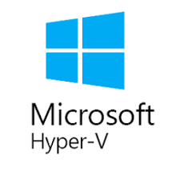

# Virtualisai Menggunakan Vargrant

## Contents

- [**Virtualisasi**](#Virtualisasi)
- [**LEMP**](#lemp)
- [**Laravel**](#laravel)
- [**Web Server**](#web-server)
- [**DNS**](#dns-domain-name-service)

## Virtualisasi

**Virtualisasi** adalah konsep dimana akses ke sebuah hardware seperti server diatur sehingga beberapa operating system dapat berbagi sebuah hardware. Tujuan dari virtualisasi adalah kinerja tingkat tinggi, ketersediaan, Efisiensi, dan untuk membuat dasar keamanan dan manajemen yang terpadu.

### Beberapa peralatan komputer yang dapat divirtualisasikan :

- Server

Mulai dari sisi akses maupun manajemen, sebuah server fisik tunggal dapat menjadi beberapa server yang biasa disebut dengan virtual server atau virtual machine (VM).

- Dekstop

Mirip dengan virtualisasi server, yaitu memungkinkan pengguna untuk menjalankan beberapa sistem operasi desktop yang berbeda beda (MAC, Windows, Linux, dll) di dalam satu komputer yang sama.

- Storage

Satu tempat penyimpanan fisik dapat terlihat menjadi beberapa driver virtual. Dengan kata lain, dengan menggunakan windows yang terpisah di console manajemen yang umum, administrator IT dapat memperlakukan drive virtual seperti drive fisik.

- Network

Di dalan jaringan, sebuah router fisik dapat mendukung beberapa, alamat IP untuk membuat router virtual. Sama seperti sebuah switch Ethernet fisik dapat mendukung beberapa alamat MAC (media access control) untuk membuat switch virtual. Sebuah hardware fisik dapat dibagi menjadi beberapa router atau switch virtual untuk mengurangi biaya.

## Virual Machine

**Virtual Machine** Virtual machine berjalan pada partisi terisolasi yang ada pada komputer host dengan resources seperti CPU, memori, dan sistem operasi tersendiri. Hal ini memungkinkan pengguna untuk menjalankan berbagai aplikasi pada virtual machine dan menggunakannya seperti biasanya pada perangkat tersebut. Alih-alih komputer fisik, Satu atau lebih virtual machine bisa berjalan pada satu perangkat keras.

### Contoh Virtual Machine :

- Hyper-V

Hyper-V adalah salah satu software virtualisasi yang biasa digunakan pada operasi sistem Windows. Bahkan windows 8, 8.1, dan Windows 10 sudah memiliki fitur ini secara default. Namun tentunya fitur-fitur yang Anda dapatkan dari versi gratis ini sangat terbatas.

- Nginx

  Nginx adalah aplikasi server open source sebagai server HTTP dan Proxy dengan fokus pada performa dan efisiensi.

- MySQL

  MySQL merupakan database server yang populer digunakan terutama dalam proses pengembangan aplikasi berbasis PHP. Alternatif selain MySQL adalah kalian bisa menggunakan database MariaDB.

- PHP

  PHP adalah bahasa pemrograman atau scripting language yang berjalan pada server side yang digunakan untuk mengembangkan web. Bahasa ini merupakan bahasa pemrograman web yang paling populer di Indonesia sehingga pilihan untuk mempelajari PHP merupakan pilihan yang bagus.

## Laravel

Laravel adalah salah satu framework yang dimiliki PHP dalam proses pengembangan website. Framework sendiri adalah kerangka kerja yang digunakan untuk mengembangkan (develop) aplikasi berbasis desktop atau aplikasi berbasis website. Dengan menggunakan framework proses mengembangkan aplikasi atau website jauh lebih mudah.

Laravel diluncurkan sejak tahun 2011 dan mengalami pertumbuhan yang cukup eksponensial. Di tahun 2015, Laravel adalah framework yang paling banyak mendapatkan bintang di Github. Sekarang framework ini menjadi salah satu yang populer di dunia, tidak terkecuali di Indonesia.

Laravel memiliki tools yang menjadi andalannya, tools tersebut adalah composer dan artisan. Composer merupakan tool yang di dalamnya terdapat dependencies dan kumpulan library. Seluruh dependencies disimpan menggunakan format file composer.json sehingga dapat ditempatkan di dalam folder utama website. Oleh karena itu composer dikenal dengan dependencies management. Sedangkan Artisan merupakan command line interface yang dimiliki oleh Laravel. Artisan mencakup sekumpulan perintah yang membantu Anda untuk membangun sebuah website atau aplikasi web.

## Web Server

**Web server** adalah sebuah software (perangkat lunak) yang memberikan layanan berupa data. Berfungsi untuk menerima permintaan HTTP atau HTTPS dari klien atau kita kenal dengan web browser (Chrome, Firefox). Selanjutnya ia akan mengirimkan respon atas permintaan tersebut kepada client dalam bentuk halaman web.

Protokol HTTP dan HTTPS digunakan web server untuk dapat berkomunikasi dengan klien. Dengan protokol HTTP dan HTTPS, komunikasi antar server dengan klien dapat saling terhubung serta dapat dimengerti dengan mudah.

### Jenis-jenis Web Server

- Nginx
- Apache
- IIS
- Lighttpd

## DNS (Domain Name Service)

**DNS** adalah sebuah sistem yang mengubah URL website ke dalam bentuk IP Address. Tanpa DNS, Anda harus mengetikkan IP Address secara lengkap ketika ingin mengunjungi sebuah website.

- Root-Level Domain merupakan bagian tertinggi dari hirarki DNS. Biasanya ia berwujud tanda titik (.) di bagian paling belakang sebuah URL.
- Top-Level Domain adalah ekstensi yang berada di bagian depan root-level domain. contoh pada gambar adalah org.
- Second-Level Domain ialah nama lain untuk domain itu sendiri. Ia sering digunakan sebagai identitas institusi atau branding. Dalam kasus URL en.wikipedia.org, yang dimaksud SLD adalah wikipedia.
- Third-Level Domain atau subdomain merupakan bagian dari domain utama yang berdiri sendiri. Apabila domain diibaratkan sebagai rumah, subdomain adalah salah satu ruang khusus di rumah itu sendiri. contoh pada gambar adalah en
- Hostname atau bisa disebut juga dengan scheme. Ini merupakan bagian yang mengawali sebuah URL. Bagian ini menunjukkan sebuah fungsi dari sebuah website atau halamannya. Contoh paling banyak digunakan, yaitu HTTPS atau Hypertext Transfer Protocol Secure.

## Link Materi Praktik

## Referensi

https://www.dicoding.com/blog/apa-itu-web-server-dan-fungsinya/

https://www.geeksforgeeks.org/working-of-domain-name-system-dns-server/

https://rifqimulyawan.com/blog/pengertian-deploy/

https://codepolitan.com/blog/tutorial-instalasi-lemp-stack-nginx-mysql-php-di-ubuntu-1604-59f04379be507

https://www.niagahoster.co.id/blog/laravel-adalah/
