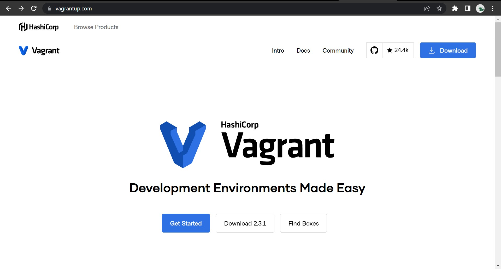
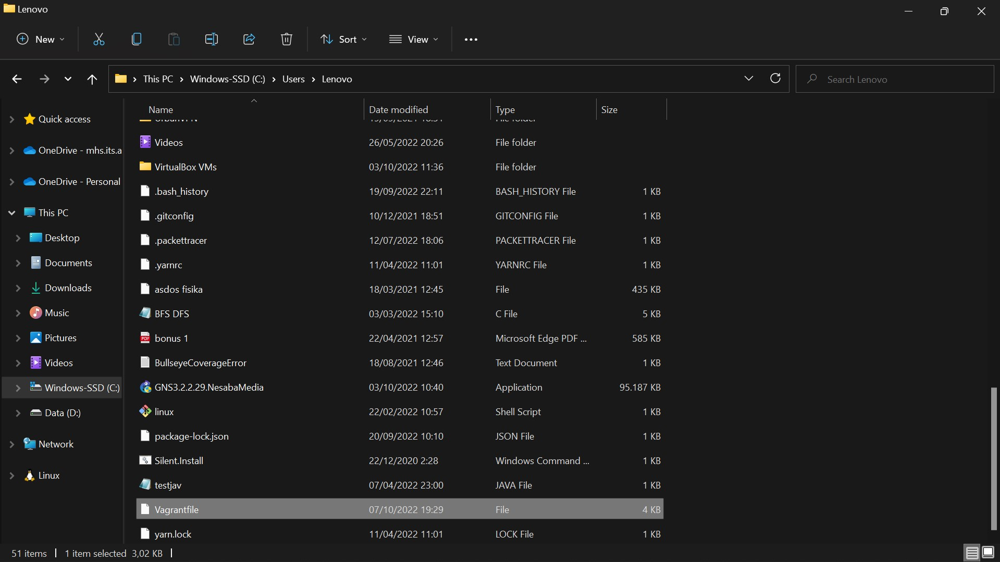
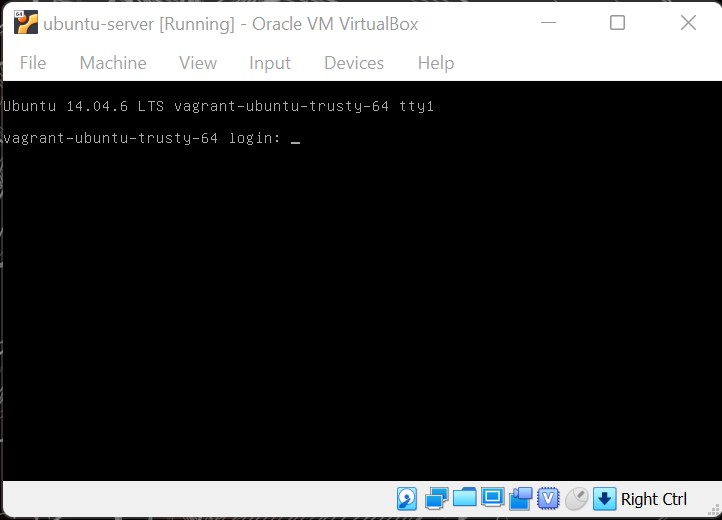

# Virtualisai Menggunakan Vagrant

## Contents

- [**Virtualisasi**](#Virtualisasi)
- [**Virtual Machine**](#VirtualMachine)
- [**vagrant**](#vagrant)
- [**Langkah - langkah**](#langkahlangkah)

## Virtualisasi

**Virtualisasi** adalah konsep dimana akses ke sebuah hardware seperti server diatur sehingga beberapa operating system dapat berbagi sebuah hardware. Tujuan dari virtualisasi adalah kinerja tingkat tinggi, ketersediaan, Efisiensi, dan untuk membuat dasar keamanan dan manajemen yang terpadu.

### Beberapa peralatan komputer yang dapat divirtualisasikan :

- Server

Mulai dari sisi akses maupun manajemen, sebuah server fisik tunggal dapat menjadi beberapa server yang biasa disebut dengan virtual server atau virtual machine (VM).

- Dekstop

Mirip dengan virtualisasi server, yaitu memungkinkan pengguna untuk menjalankan beberapa sistem operasi desktop yang berbeda beda (MAC, Windows, Linux, dll) di dalam satu komputer yang sama.

- Storage

Satu tempat penyimpanan fisik dapat terlihat menjadi beberapa driver virtual. Dengan kata lain, dengan menggunakan windows yang terpisah di console manajemen yang umum, administrator IT dapat memperlakukan drive virtual seperti drive fisik.

- Network

Di dalan jaringan, Sama seperti sebuah switch Ethernet fisik dapat mendukung beberapa alamat MAC (media access control) untuk membuat switch virtual. Sebuah hardware fisik dapat dibagi menjadi beberapa router atau switch virtual untuk mengurangi biaya.

## Virtual Machine

**Virtual Machine** berjalan pada partisi terisolasi yang ada pada komputer host dengan resources seperti CPU, memori, dan sistem operasi tersendiri. Hal ini memungkinkan pengguna untuk menjalankan berbagai aplikasi pada virtual machine dan menggunakannya seperti biasanya pada perangkat tersebut. Alih-alih komputer fisik, Satu atau lebih virtual machine bisa berjalan pada satu perangkat keras.

### Contoh Virtual Machine :

- Hyper-V

**Hyper-V** adalah salah satu software virtualisasi yang biasa digunakan pada sistem operasi Windows. Bahkan windows 8, 8.1, dan Windows 10 sudah memiliki fitur ini secara default. Namun tentunya fitur-fitur yang Anda dapatkan dari versi gratis ini sangat terbatas.

- Virtual Box

**VirtualBox** adalah software virtualisasi open-source yang mendukung semua sistem operasi sesuai dengan kebutuhan Anda.Karena bersifat open-source, Anda bisa mendapatkan software ini dengan sangat mudah. Anda hanya perlu membuka websitenya dan mendownload secara langsung.

- Qemu

**Qemu** adalah software virtualisasi yang bisa menjalankan virtual machine pada sistem operasi Linux dan Windows.Berasal dari singkatan Quick Emulator, Qemu bersifat open-source dan bisa digunakan secara gratis. Anda hanya perlu membuka website dan mendownload file untuk memulai.

- VMware

**VMware** adalah penyedia perangkat lunak virtualisasi dan komputasi awan yang berbasis di Palo Alto, California. Didirikan pada tahun 1998, VMware adalah anak perusahaan Dell Technologies. EMC Corporation awalnya mengakuisisi VMware pada tahun 2004; EMC kemudian diakuisisi oleh Dell Technologies pada tahun 2016.

## Vagrant

**Vagrant** adalah open-source software yang digunakan untuk provisioning dan managing virtual machine / instances . Vagrant dibuat untuk otomatisasi provisioning virtual machine dan instances sehingga mengurangi lama waktu setup environment development.

Vagrant menyediakan kemudahan konfigurasi karena dibangun diatas standar teknologi untuk memaksimalkan produktivitas dan fleksibilitas tim development.

## Praktik Provisioning dengan Vagrant

**Instalasi Tools**

Dalam praktik provisioning yang akan dilakukan. Kita perlu menginstal terlebih dahulu tools yang akan kita gunakan yaitu :

- Vagrant

instalasi bisa melalui link berikut
https://www.vagrantup.com/

- Virtual Box

instalasi bisa melalui link berikut
https://www.virtualbox.org/

### Langkah - langkah

- Buka cmd

- Cek apakah vagrant sudah terinstall dengan cmd
  `vagrant -v`

- Pilih box yang akan divirtualisasi dengan vagrant klik find box, disini kita akan virtualisasikan ubuntu server

- Disini kita pilih ubuntu untuk box yang akan kita pakai adalah `generic/ubuntu2004`
  

- Inisialisai box yang dipilih pada vagrant melalui cmd `vagrant init generic/ubuntu2004`

- Akan terlihat document `vagrantfile` pada direktori

- Buka vagrantfile pada vscode dan konfigurasi vagrant melalui vagrantfile

- Jalankan box tersebut pada vagrant dengan perintah `vagrant up`

- Akan terlihat virtual machine baru yang otomatis terbuat dan dijalankan

- Lalu kita masukkan username dan password sama yaitu vagrant , karena secara default username dan passwordnya adalah vagrant

Maka kita telah berhasil masuk ke dalam os linux yang telah kita buat.

## Referensi

https://www.vagrantup.com/

https://www.virtualbox.org/

https://sis.binus.ac.id/2014/10/11/konsep-dasar-virtualisasi/

https://barki.uma.ac.id/2021/12/30/virtual-machine-pengertian-jenis-jenis-dan-manfaatnya/
