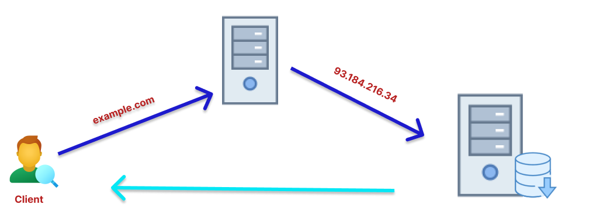

# Deploy LEMP Using Vagrant

## Contents

* [**Deploy**](#deploy)

## Deploy
Deploy atau deployment adalah kegiatan yang merupakan untuk mengembangkan aplikasi atau website yang tidak bisa lepas dari kegiatan para programmer. Ada beberapa proses yang harus dikerjakan oleh para programmer hingga akhirnya bisa menciptakan website atau aplikasi sendiri.

Salah satu yang tidak boleh disepelekan adalah saat menyusun kode (coding) untuk dimasukan ke server dan menyetel atau setup server tersebut agar dapat menghasilkan suatu halamaan web atau aplikasi.

## Link Materi Praktik

