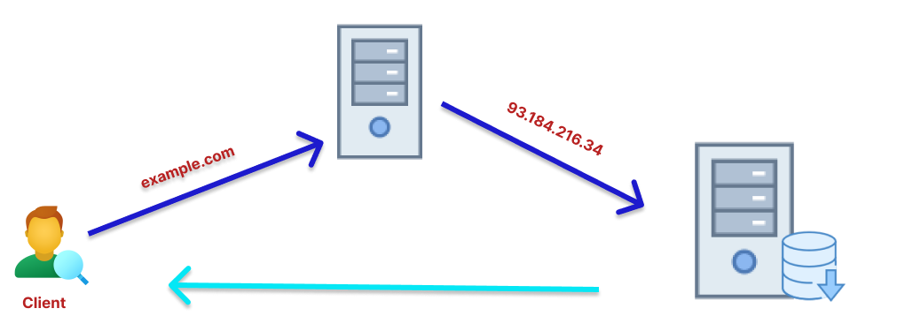
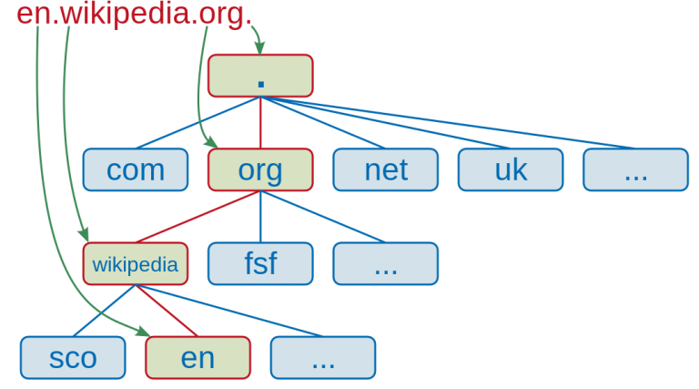

# Deploy LEMP Using Vagrant

## Contents

* [**Deploy**](#deploy)
* [**LEMP**](#lemp)
* [**Laravel**](#laravel)
* [**Web Server**](#web-server)
* [**DNS**](#dns-domain-name-service)

## Deploy
**Deploy** atau deployment adalah kegiatan yang merupakan untuk mengembangkan aplikasi atau website yang tidak bisa lepas dari kegiatan para programmer. Ada beberapa proses yang harus dikerjakan oleh para programmer hingga akhirnya bisa menciptakan website atau aplikasi sendiri.

Salah satu yang tidak boleh disepelekan adalah saat menyusun kode (coding) untuk dimasukan ke server dan menyetel atau setup server tersebut agar dapat menghasilkan suatu halamaan web atau aplikasi.

## LEMP Stack
**LEMP Stack** adalah seperangkat aplikasi yang digunakan secara bersamaan untuk menjalankan web server. LEMP merupakan singkatan (akronim) dari Linux + Nginx + MySQL + PHP.

- Linux

  Linux berperan sebagai sistem operasi, tempat dimana kita menginstal dan menjalankan Nginx, MySQL dan PHP. Linux sendiri merupakan sistem operasi yang populer digunakan sebagai server. 

- Nginx
  
  Nginx adalah aplikasi server open source sebagai server HTTP dan Proxy dengan fokus pada performa dan efisiensi.

- MySQL

  MySQL merupakan database server yang populer digunakan terutama dalam proses pengembangan aplikasi berbasis PHP. Alternatif selain MySQL adalah kalian bisa menggunakan database MariaDB.

- PHP
  
  PHP adalah bahasa pemrograman atau scripting language yang berjalan pada server side yang digunakan untuk mengembangkan web. Bahasa ini merupakan bahasa pemrograman web yang paling populer di Indonesia sehingga pilihan untuk mempelajari PHP merupakan pilihan yang bagus. 

## Laravel
 Laravel adalah salah satu framework yang dimiliki PHP dalam proses pengembangan website. Framework sendiri adalah kerangka kerja yang digunakan untuk mengembangkan (develop) aplikasi berbasis desktop atau aplikasi berbasis website. Dengan menggunakan framework proses mengembangkan aplikasi atau website jauh lebih mudah.

 Laravel diluncurkan sejak tahun 2011 dan mengalami pertumbuhan yang cukup eksponensial. Di tahun 2015, Laravel adalah framework yang paling banyak mendapatkan bintang di Github. Sekarang framework ini menjadi salah satu yang populer di dunia, tidak terkecuali di Indonesia.  
 
 Laravel memiliki tools yang menjadi andalannya, tools tersebut adalah composer dan artisan. Composer merupakan tool yang di dalamnya terdapat dependencies dan kumpulan library. Seluruh dependencies disimpan menggunakan format file composer.json sehingga dapat ditempatkan di dalam folder utama website. Oleh karena itu composer dikenal dengan dependencies management. Sedangkan Artisan merupakan command line interface yang dimiliki oleh Laravel. Artisan mencakup sekumpulan perintah yang membantu Anda untuk membangun sebuah website atau aplikasi web. 

## Web Server
**Web server** adalah sebuah software (perangkat lunak) yang memberikan layanan berupa data. Berfungsi untuk menerima permintaan HTTP atau HTTPS dari klien atau kita kenal dengan web browser (Chrome, Firefox). Selanjutnya ia akan mengirimkan respon atas permintaan tersebut kepada client dalam bentuk halaman web.

Protokol HTTP dan HTTPS digunakan web server untuk dapat berkomunikasi dengan klien. Dengan protokol HTTP dan HTTPS, komunikasi antar server dengan klien dapat saling terhubung serta dapat dimengerti dengan mudah.

### Jenis-jenis Web Server
- Nginx
- Apache
- IIS
- Lighttpd

## DNS (Domain Name Service)
**DNS** adalah sebuah sistem yang mengubah URL website ke dalam bentuk IP Address. Tanpa DNS, Anda harus mengetikkan IP Address secara lengkap ketika ingin mengunjungi sebuah website.

 - Root-Level Domain merupakan bagian tertinggi dari hirarki DNS. Biasanya ia berwujud tanda titik (.) di bagian paling   belakang sebuah URL.
 - Top-Level Domain adalah ekstensi yang berada di bagian depan root-level domain. contoh pada gambar adalah org.
 - Second-Level Domain ialah nama lain untuk domain itu sendiri. Ia sering digunakan sebagai identitas institusi atau branding. Dalam kasus URL en.wikipedia.org, yang dimaksud SLD adalah wikipedia.
 - Third-Level Domain atau subdomain merupakan bagian dari domain utama yang berdiri sendiri. Apabila domain diibaratkan sebagai rumah, subdomain adalah salah satu ruang khusus di rumah itu sendiri. contoh pada gambar adalah en
 - Hostname atau bisa disebut juga dengan scheme. Ini merupakan bagian yang mengawali sebuah URL. Bagian ini menunjukkan sebuah fungsi dari sebuah website atau halamannya. Contoh paling banyak digunakan, yaitu HTTPS atau Hypertext Transfer Protocol Secure.

## Link Materi Praktik

## Referensi
https://www.dicoding.com/blog/apa-itu-web-server-dan-fungsinya/

https://www.geeksforgeeks.org/working-of-domain-name-system-dns-server/

https://rifqimulyawan.com/blog/pengertian-deploy/

https://codepolitan.com/blog/tutorial-instalasi-lemp-stack-nginx-mysql-php-di-ubuntu-1604-59f04379be507

https://www.niagahoster.co.id/blog/laravel-adalah/