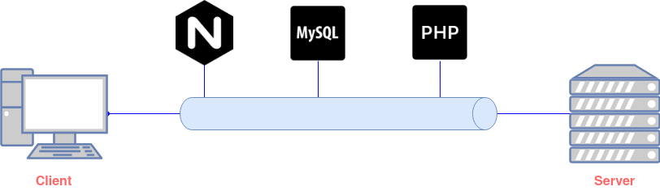

# Deployment Aplikasi dengan LEMP *Stack*
Pembahasan pada modul ketiga dari LBE Laboratorium AJK 2022 adalah mengenai *deployment* dari suatu aplikasi. Rincian konten bahasan dari modul ini adalah sebagai berikut.

  - [**Pengenalan Konsep *Deploy* Aplikasi**](#pengenalan-konsep-deploy-aplikasi)
  - [**Mengenal LEMP *Stack* dalam *Deploy* Aplikasi**](#mengenal-lemp-stack-dalam-deploy-aplikasi)
  - [**LEMP *Stack* vs LAMP *Stack***](#lemp-stack-vs-lamp-stack)
  - [**Instalasi LEMP Stack**](#instalasi-lemp-stack)
  - [***Prerequisites* dan Praktik Deploy Aplikasi**](#prerequisites-dan-praktik-deploy-aplikasi)
  - [**Referensi**](#referensi)

## **Pengenalan Konsep *Deploy* Aplikasi**

Saat proses *development* aplikasi (baik *web*, *desktop app*, maupun *mobile app*), hal yang diinginkan adalah dapat digunakannya aplikasi tersebut oleh pengguna lain. Dalam hal ini, proses *deployment* menjadi jawabannya.

*Deploy* (selanjutnya akan disebut sebagai *deployment*) adalah salah satu kegiatan penting dalam proses *development* suatu aplikasi. Singkatnya, *deployment* merupakan proses menaruh aplikasi yang sebelumnya hanya dapat dijalankan di komputer *developer* ke dalam *server* yang terhubung dengan jaringan yang luas sehingga aplikasi yang telah di-*develop* tersebut dapat diakses dan digunakan oleh banyak pengguna lain di internet. *Server* sendiri pada dasarnya adalah sebuah komputer yang mempunyai fungsi untuk menyajikan beberapa *file* ketika terdapat permintaan melalui internet. Seperti yang diketahui, setiap komputer pasti memiliki sistem operasi seperti Windows, Linux dan lain sebagainya, begitu juga dengan *server* yang juga memiliki sistem operasi.

Dalam proses *deployment* ini, terdapat beberapa *stack* yang dapat digunakan dengan konfigurasi yang berbeda-beda sesuai *stack* yang digunakan tersebut. Salah satu *stack* yang dapat digunakan adalah LEMP *stack*. Apakah itu?

 

## **Mengenal LEMP *Stack* dalam *Deploy* Aplikasi**

Salah satu *stack web server* untuk *deployment* aplikasi adalah LEMP. LEMP adalah singkatan dari Linux, Nginx (baca: engine-ex), MySQL, dan PHP. LEMP menjadi salah satu *stack* yang sangat populer. Komponen yang membentuk LEMP ini bersifat *open-source* dengan dukungan komunitas yang sangat besar. 

Mungkin saat mengulik tentang LEMP *stack*, akan ditemui juga *stack* lain yang merupakan ‘saudara’ dari LEMP *stack*, yaitu LAMP *stack*. Huruf A pada LAMP *stack* adalah Apache. Sehingga, perbedaannya hanyalah pada penggunakan *web server*-nya. Jika menggunakan Apache, maka disebut LAMP *stack*, dan jika menggunakan Nginx maka disebut LEMP *stack*. *Web server* Apache sudah terbilang cukup lama yaitu sejak tahun 1995, sedangkan Nginx baru di tahun 2005. Tapi, seberapa signifikan perbedaa,nya?

 

## **LEMP *Stack* vs LAMP *Stack***

Menjawab pertanyaan pada *section* sebelumnya, hal yang menjadi pembeda antara LEMP *stack* dan LAMP *stack* ini hanya terletak pada penggunaan *web server*-nya (Nginx atau Apache). 

<aside>
💡 **Apa itu Web Server?**

*Web server* adalah sebuah *software* yang memberikan layanan berupa data dan berfungsi untuk menerima permintaan HTTP atau HTTPS dari *client* atau kita kenal dengan *web browser* (Chrome, Firefox, atau lainnya). Selanjutnya, *web server* akan mengirimkan respon atas permintaan tersebut kepada *client* dalam bentuk halaman *web*.

Protokol HTTP dan HTTPS digunakan *web server* untuk dapat berkomunikasi dengan *client*. Dengan protokol HTTP dan HTTPS, komunikasi antar *server* dengan *client* dapat saling terhubung serta dapat dimengerti dengan mudah.

Jenis-jenis *web server* yang populer antara lain yaitu Nginx, Apache, IIS, dan Lighttpd.

</aside>

Sehingga, berikut ditampilkan perbedaan antara keduanya.

| **Perbedaan** | **Nginx** | **Apache** |
| --- | --- | --- |
| **Konsep** | Based on event (tidak akan memproses suatu pekerjaan meskipun ada request baru — multitasking) | Based on process (membuat proses dan pekerjaan hanya jika ada request) |
| **Performa** | Static content serta lebih cepat 2.5 kali dibanding Apache | Dynamic content  |
| **Dukungan** **OS** | Unix system dengan dukungan sedikit pada Microsoft Windows | Unix system dan dukungan penuh Microsoft Windows |
| **Keamanan** | Tersedia konfigurasi untuk dapat melakukan limitasi pada jumlah request dan jumlah koneksi pada konfigurasi Nginx | Tersedia konfigurasi untuk menangani DDoS Attack termasuk dengan Mod Evasive, module yang berurusan dengan HTTP DoS, DDoS atau Brute Force Attack |
| **Dukungan** **Hosting** | VPS hosting, dedicated hosting, atau cluster container | Shared hosting |

Sehingga, antara LEMP *stack* dan LAMP *stack* memiliki keunggulan masing-masing. Namun, Nginx memiliki kelebihan sendiri dibandingkan Apache dalam performa dan penggunaan memori yang kecil. Karena bahasan modul ini juga terfokus pada LEMP *stack*, jadi bagaimana cara implementasinya?

 

## **Instalasi LEMP Stack**

Kembali lagi ke dalam bahasan LEMP *stack,* terdapat beberapa hal yang harus diketahui sesuai dengan komponen dari LEMP *stack* itu sendiri sebelum memulai implementasinya. 

1. **Linux**
    
    Linux berperan sebagai sistem operasi di mana Nginx, MySQL, dan PHP berjalan. Linux merupakan sistem operasi *server* yang sangat populer. Hal ini dikarenakan Linux mudah untuk didapatkan, mudah untuk dipasang, serta mudah untuk dikonfigurasi. Dengan komunitas yang amat besar, tak sulit mencari panduan atau bantuan dalam mempelajarinya.
    
2. **Nginx**
    
    Nginx adalah aplikasi server *open source* sebagai server HTTP dan Proxy dengan fokus pada performa dan efisiensi.
    
3. **MySQL**
    
    MySQL adalah salah satu *database server* yang banyak digunakan. MySQL sangat populer di kalangan PHP *developer*. Bahkan, dalam berbagai tempat untuk belajar mengenai *web development*, maka nama MySQL biasanya akan selalu ikut disebut sebagai judul maupun bahasan utamanya.
    
4. **PHP**
    
    PHP adalah bahasa pemrograman atau *scripting language* yang berjalan pada *server side* yang digunakan untuk *web development*. Bahasa ini merupakan bahasa pemrograman *web* yang paling populer di Indonesia sehingga pilihan untuk mempelajari PHP merupakan pilihan yang bagus.
    
5. **Laravel**
    
    Laravel adalah salah satu *framework* yang dimiliki PHP dalam proses *web development*. Dengan menggunakan *framework,* proses mengembangkan aplikasi atau *website* jauh lebih mudah.
    
    Laravel diluncurkan sejak tahun 2011 dan mengalami pertumbuhan yang cukup eksponensial. Di tahun 2015, Laravel adalah *framework* yang paling banyak mendapatkan bintang di Github. Sekarang, *framework* ini menjadi salah satu yang populer di dunia, tidak terkecuali di Indonesia.
    
    Laravel memiliki *tools* yang menjadi andalannya. *Tools* tersebut adalah *composer* dan *artisan*. *Composer* merupakan *tool* yang di dalamnya terdapat *dependencies* dan kumpulan *library*. Seluruh *dependencies* disimpan menggunakan format *file* `composer.json` sehingga dapat ditempatkan di dalam folder utama *website*. Oleh karena itu, *composer* dikenal dengan *dependencies management*. Sedangkan Artisan merupakan *command line interface* yang dimiliki oleh Laravel. Artisan mencakup sekumpulan perintah yang membantu untuk proses *web development*.
    

Setelah mengetahui tentang komponen dari LEMP *stack,* maka lanjut ke cara implementasinya. Bagaimana langkah-langkahnya?

 

## ***Prerequisites* dan Praktik Deploy Aplikasi**

Hal pertama yang harus diperhatikan adalah *prerequisites*, atau hal-hal yang harus diketahui dan dipersiapkan sebelum melakukan praktik *deployment*. 

1. Buat `sudo` *user* dan *enable* `ufw`.
2. *Install* Nginx.
3. *Install* MySQL.
4. *Install* PHP dan Laravel (versi terbaru saat ini).
5. *Install* Composer.

Referensi dari *prerequisites* tersebut akan terdapat pada bahasan di modul selanjutnya, yaitu pada **Praktik Deploy dengan Vagrant** pada tautan di bawah berikut.

[https://github.com/danielcristho/vagrant-deploy-LEMP](https://github.com/danielcristho/vagrant-deploy-LEMP)

 

## **Referensi**

[https://www.dicoding.com/blog/apa-itu-web-server-dan-fungsinya/](https://www.dicoding.com/blog/apa-itu-web-server-dan-fungsinya/)

[https://www.geeksforgeeks.org/working-of-domain-name-system-dns-server/](https://www.geeksforgeeks.org/working-of-domain-name-system-dns-server/)

[https://rifqimulyawan.com/blog/pengertian-deploy/](https://rifqimulyawan.com/blog/pengertian-deploy/)

[https://codepolitan.com/blog/tutorial-instalasi-lemp-stack-nginx-mysql-php-di-ubuntu-1604-59f04379be507](https://codepolitan.com/blog/tutorial-instalasi-lemp-stack-nginx-mysql-php-di-ubuntu-1604-59f04379be507)

[https://www.niagahoster.co.id/blog/laravel-adalah/](https://www.niagahoster.co.id/blog/laravel-adalah/)

[https://www.idcode.dev/2022/01/cara-install-lemp-untuk-laravel-di.html](https://www.idcode.dev/2022/01/cara-install-lemp-untuk-laravel-di.html)

[https://jagongoding.com/linux/ubuntu/cara-install-lemp-stack-nginx-mariadb-php-di-ubuntu-1904/](https://jagongoding.com/linux/ubuntu/cara-install-lemp-stack-nginx-mariadb-php-di-ubuntu-1904/)

[https://codepolitan.com/blog/tutorial-instalasi-lemp-stack-nginx-mysql-php-di-ubuntu-1604-59f04379be507](https://codepolitan.com/blog/tutorial-instalasi-lemp-stack-nginx-mysql-php-di-ubuntu-1604-59f04379be507)

[https://medium.com/@sagarnasit/deploy-laravel-application-with-lemp-stack-ubuntu-and-enginx-e82a4445b3d2](https://medium.com/@sagarnasit/deploy-laravel-application-with-lemp-stack-ubuntu-and-enginx-e82a4445b3d2)

[https://www.digitalocean.com/community/tutorials/how-to-install-and-configure-laravel-with-lemp-on-ubuntu-18-04](https://www.digitalocean.com/community/tutorials/how-to-install-and-configure-laravel-with-lemp-on-ubuntu-18-04)

[https://www.dewaweb.com/blog/lamp-atau-lemp-manakah-yang-lebih-baik/](https://www.dewaweb.com/blog/lamp-atau-lemp-manakah-yang-lebih-baik/)

[https://republikwebsite.com/lamp-atau-lemp/](https://republikwebsite.com/lamp-atau-lemp/)